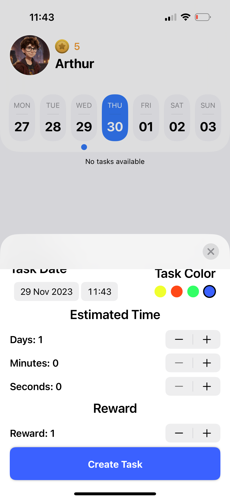
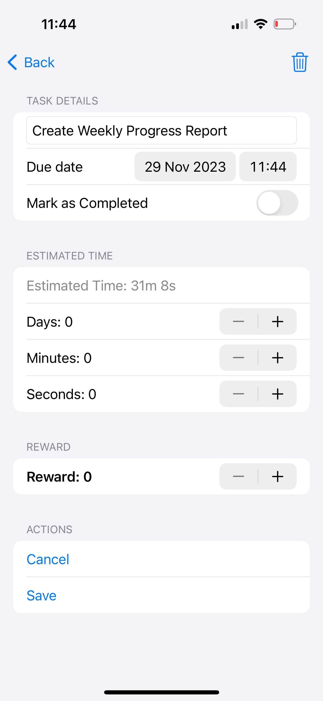

# Task Manager App

## Overview

The Task Manager App is a SwiftUI-based iOS application that helps users manage and organize their tasks efficiently. This app allows users to create, edit, and delete tasks, set due dates, and track estimated time and rewards associated with each task.

## Features

- Create tasks with a title, due date, estimated time, and reward.
- Mark tasks as completed or incomplete.
- Edit existing tasks, including title, due date, estimated time, and reward.
- Organize tasks by color-coded categories.
- Intuitive user interface for a seamless task management experience.

## Screenshots

<table>
  <tr>
    <td>Home</td>
    <td>Home without Task</td>
  </tr>
  <tr>
    <td></td>
    <td></td>
  </tr>
</table>

<table>
    <tr>
        <td>Sheet to Add Task</td>
        <td>Task Detail View</td>
        <td>Task Edit View</td>
    </tr>
    <tr>
      <td></td>
      <td></td>
      <td></td>
    </tr>
</table>

